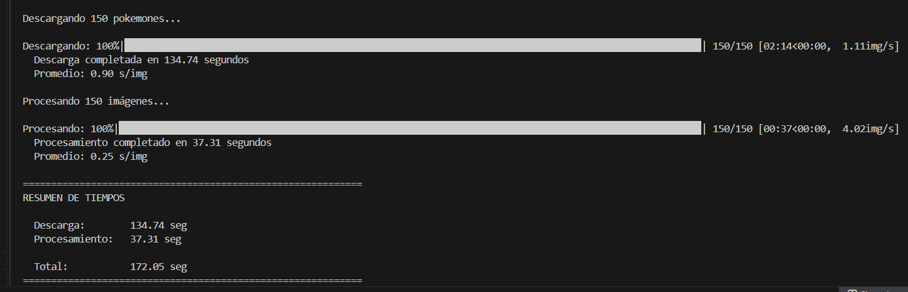

```
⡐⢂⠲⡐⢢⢀⠂⡔⠠⠒⡄⢃⡒⠔⡂⠖⡐⢆⠒⡔⢂⠲⡐⢂⠖⡐⢢⠒⡰⢂⡈⣿⣿⣿⣿⣿⣿⣿⣿⣿⣿⣿⣿⣿⣿⣿
⠰⡉⢆⢡⠃⣄⠣⢀⠣⠄⢘⡡⠘⡄⢣⢘⠰⣈⠒⡌⡘⠤⡑⢊⠔⡉⢆⠱⢠⠃⡄⣹⣿⣿⣿⣿⣿⣿⣿⣿⣿⢿⣻⡽⣯⠟
⢂⠱⡈⠆⣸⢆⠡⢂⠒⣈⠐⡄⢋⠔⡡⢊⠔⢢⠑⡄⢃⡒⢡⠊⡔⢡⠊⡔⢡⠊⡔⢙⣿⣿⣿⣿⣿⣿⣿⣿⣟⣯⢿⡽⢧⢋
⡈⢆⡑⢲⢻⣌⡳⣌⢶⣠⢃⠘⠤⢊⠔⡡⢊⠤⢃⠜⡰⢈⠆⡱⢈⠆⡱⢈⠆⡱⢈⠜⣿⣿⣿⣿⣿⣿⣿⣿⢯⣟⣯⣟⡯⢆
⡐⢂⠀⡀⠁⢚⠿⣽⣻⢾⣭⠎⡐⢣⠘⡄⢣⠘⡄⢎⠰⡁⢎⠰⡁⢎⠰⡁⢎⠰⡁⠆⢿⡿⣿⣿⣿⣿⡿⣯⣿⣻⢾⣽⣛⡆
⡘⢄⣀⠀⠸⣿⣿⣶⣭⡛⢾⣓⠈⢆⠱⡈⢆⠱⡈⢆⠱⡈⢆⠱⡈⢆⠱⡈⢆⠱⣈⠱⡘⠿⡽⢻⡞⣷⢻⢯⠷⣟⠿⠾⠝⠂
⠌⣸⣿⢿⡄⢻⣿⣿⣿⣿⣷⣦⣉⠢⡑⢌⠢⡑⢌⠢⡑⢌⠢⡑⢌⠢⡑⢌⠢⡑⠤⢃⠄⠰⢀⠃⡐⠠⠂⣀⣢⣴⣶⣿⡇⠀
⢲⣿⢯⣟⣷⡘⣿⣿⣿⣿⣿⣿⣿⣷⣮⡀⢇⡘⢄⠣⡘⢄⠣⡘⢄⠣⡘⢢⢑⡘⡰⢉⠜⠀⡌⣤⣴⣶⣿⣿⣿⣿⣿⣿⠇⠀
⣿⢯⣟⡿⣞⠳⡘⢿⣿⣿⣿⣿⣿⣿⣿⣿⣦⡘⠄⢣⣜⣀⣃⣘⣂⣡⣑⣂⣈⢐⣁⣎⣶⣷⣿⣿⣿⣿⣿⣿⣿⣿⣿⡟⠀⡐
⣿⢯⡿⣽⢏⢣⠐⡈⠻⣿⣿⣿⣿⣿⣿⣿⣿⣿⣿⣿⣿⣿⣿⣿⣿⣿⣿⣿⣿⣿⣿⣿⣿⣿⣿⣿⣿⣿⣿⣿⣿⣿⠏⣀⠔⡠
⠌⢋⡙⠤⠋⢄⠃⠤⠁⠙⢿⣿⡿⣿⣿⣿⣿⣿⣿⣿⣿⣿⣿⣿⣿⣿⣿⣿⣿⣿⣿⣿⣿⣿⣿⣿⣿⣿⣿⣿⠟⣡⣾⢯⣟⡔
⠀⠂⠀⠄⢁⠂⠌⠤⢁⠂⠀⢡⣾⣿⣿⣿⣿⣿⣿⣿⣿⣿⣿⣿⣿⣿⣿⣿⣿⣿⣿⣿⣿⣿⣿⣿⣯⡻⢋⣥⣾⡿⣯⣟⡾⡐
⠀⠀⠀⠀⠀⡈⠰⢈⠆⡘⢠⣿⣿⣿⣿⡿⠛⠿⣿⣿⣿⣿⣿⣿⣿⣿⣿⣿⣿⡿⠛⢿⣿⣿⣿⣿⣿⣷⡜⢯⣷⣻⢷⡻⣜⠡
⠀⠀⠀⠀⠀⢀⠡⢊⠔⣉⣾⣿⣿⣿⣿⠘⠛⠀⢿⣿⣿⣿⣿⣿⣿⣿⣿⣿⣿⠘⠟⠀⣿⣿⣿⣿⣿⣿⣿⡨⢓⡹⢎⡱⢌⠡
⠀⠀⠀⠀⠀⠀⠂⠥⡚⣼⣿⣿⣿⣿⣿⣶⣤⣾⣿⣿⣿⡿⠿⣿⣿⣿⣿⣿⣿⣷⣤⣶⣿⣿⣿⣿⣿⣿⣿⣇⠡⠒⢄⠒⡨⠐
⠀⠀⠀⠀⠀⠠⡉⢦⢡⡿⢟⡻⠟⠿⣿⣿⣿⣿⣿⣿⣿⣷⣤⣾⣿⣿⣿⣿⣿⣿⣿⣿⡿⢟⢻⡛⢻⣿⣿⣿⡄⢡⠊⠤⡑⠌
⢀⡄⣄⢢⣌⡵⣜⣮⢹⣡⠚⣔⢋⢎⣹⣿⣿⣿⣿⣿⣿⡿⠿⠿⠿⢿⣿⣿⣿⣿⣿⣿⠔⣊⠦⣍⢣⢾⣿⣿⡧⢮⣝⣲⢡⢊
⣾⣼⣞⡷⣾⣽⣻⢾⣸⣷⣼⣬⣷⣴⣿⣿⣿⣿⣿⣿⡏⣾⣿⣿⣿⣷⢹⣿⣿⣿⣿⣿⣲⣩⣶⣬⣶⣾⣿⣿⣿⠾⣽⣳⣏⠆
⣿⢾⣽⣻⢷⣯⣟⣯⣧⢿⣿⣿⣿⣿⣿⣿⣿⣿⣿⣿⣷⣙⣿⠿⡿⣏⣼⣿⣿⣿⣿⣿⣿⣿⣿⣿⣿⣿⣿⣿⣿⣶⣿⣳⢿⡌
⣿⢯⣷⢿⣻⡾⣽⣳⣯⢧⢻⣿⣿⣿⣿⣿⣿⣿⣿⣿⣿⣿⣿⣷⣾⣿⣿⣿⣿⣿⣿⣿⣿⣿⣿⣿⣿⣿⣿⣿⣿⣧⣾⣽⡻⡔
⣟⡿⣞⣯⢷⣻⣽⣳⢯⡟⣇⣻⣿⣿⣿⣿⣿⣿⣿⣿⣿⣿⣿⣿⣿⣿⣿⣿⣿⣿⣿⣿⣿⣿⣿⣿⣿⣿⣿⣿⣿⣿⠓⣯⠳⠌
⠸⢹⠙⡎⢏⠳⢍⠫⡙⡜⢄⣿⣿⣿⣿⣿⣿⣿⣿⣿⣿⣿⣿⣿⣿⣿⣿⣿⣿⣿⣿⣿⣿⣿⣿⣿⣿⣿⣿⣿⣿⣿⣆⠣⡙⡐
```

**Problema:** La descarga es lenta porque el programa espera la respuesta de la red.
**Solucion:** Se uso `ThreadPoolExecutor` (concurrencia). Esto permite que multiples descargas ocurran al mismo tiempo, solapando los tiempos de espera y acelerando el proceso drasticamente.

**Problema:** La transformacion de imagenes consume mucho CPU.
**Solucion:** Se uso `ProcessPoolExecutor` (paralelismo). Esto distribuye el trabajo entre multiples nucleos del procesador, permitiendo que varias imagenes se procesen realmente al mismo tiempo y evitando la limitacion del GIL de Python.

## Tabla Comparativa de Tiempos

A continuación, se presenta una tabla con los resultados obtenidos al ejecutar el script `baseline` y el script optimizado.

| Fase            | Tiempo Baseline (segundos) | Tiempo Optimizado (segundos) | Mejora                          |
|-----------------|----------------------------|------------------------------|---------------------------------|
| Descarga        | 134.74                     | 21.03                        | 113.71 sec veces más rápido     |
| Procesamiento   | 37.31                      | 11.08                        | 26.23 sec veces más rápido      |
| **Tiempo Total**| **172.05**                 | **32.11**                    | **139.94** sec veces más rápido |




